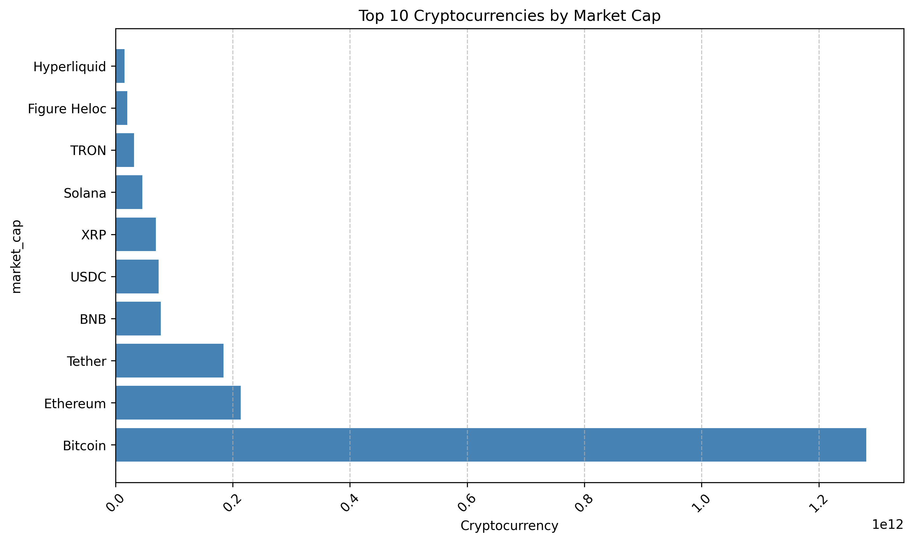
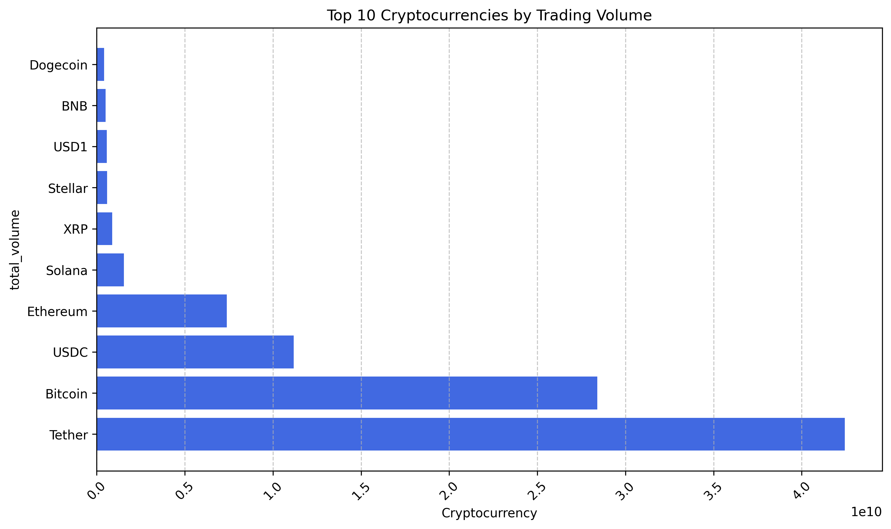
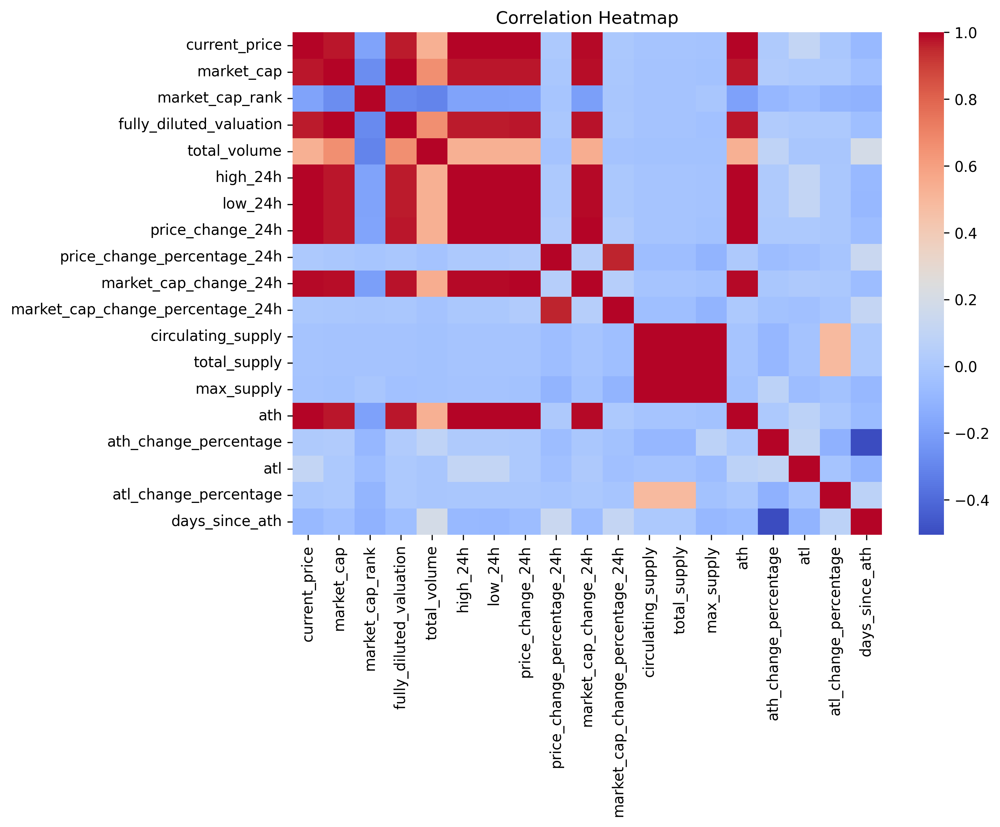

# 📊 Cryptocurrency Market Analysis using CoinGecko API

## 📌 Project Overview

This project performs an end-to-end analysis of the top 100 cryptocurrencies using live market data from the CoinGecko REST API.

The project demonstrates a complete data analysis workflow, including API data extraction, data cleaning, feature engineering, exploratory data analysis (EDA), and data visualization using Python.

---

## 🎯 Project Objectives

- Extract live cryptocurrency market data using the CoinGecko API.
- Clean and preprocess the dataset for analysis.
- Engineer new business-focused features.
- Perform exploratory data analysis to identify market trends.
- Build visualizations to communicate insights effectively.
- Generate meaningful business insights from the cryptocurrency market.

---

## 🛠️ Technologies Used

- Python
- Pandas
- NumPy
- Matplotlib
- Seaborn
- Requests
- CoinGecko REST API

---

## 📂 Project Structure

```
Crypto-Market-Analysis/
│
├── data/
│   ├── crypto_raw.csv
│   └── crypto_cleaned.csv
│
├── notebook/
│   └── Cryptocurrency_Market_Analysis.ipynb
│
├── images/
│   ├── top_market_cap.png
│   ├── top_10_trading_volume.png
│   ├── top_10_gainers.png
│   ├── top_10_losers.png
│   ├── market_cap_distribution.png
│   ├── supply_distribution.png
│   ├── price_distribution.png
│   ├── correlation_heatmap.png
│   ├── market_cap_vs_trading_volume.png
│   └── days_since_ath_distribution.png
│
├── README.md
├── requirements.txt
└── LICENSE
```

---

## 🔄 Project Workflow

```
CoinGecko API
        │
        ▼
Data Extraction
        │
        ▼
Data Understanding
        │
        ▼
Data Cleaning
        │
        ▼
Feature Engineering
        │
        ▼
Exploratory Data Analysis
        │
        ▼
Data Visualization
        │
        ▼
Business Insights
```

---

## 🧹 Data Cleaning

- Removed unnecessary columns.
- Investigated missing values.
- Removed rows with critical missing values.
- Converted date columns into datetime format.
- Saved a cleaned dataset for analysis.

---

## ⚙️ Feature Engineering

The following business features were created:

- **Supply Status**
  - Fixed Supply
  - Unlimited Supply

- **Price Movement**
  - Gainer
  - Loser

- **Market Cap Category**
  - Large Cap
  - Mid Cap
  - Small Cap

- **Days Since ATH**
  - Number of days since each cryptocurrency reached its All-Time High.

---

## 📊 Exploratory Data Analysis (EDA)

The analysis answers several business questions:

- Which cryptocurrencies dominate the market by capitalization?
- Which cryptocurrencies have the highest trading volume?
- Which cryptocurrencies experienced the highest gains and losses?
- How are cryptocurrencies distributed across market-cap categories?
- How many cryptocurrencies have fixed vs unlimited supply?
- How long has it been since each cryptocurrency reached its All-Time High?
- What relationships exist among market cap, trading volume, and price?

---

## 📈 Visualizations

The project includes the following visualizations:

- Top 10 Cryptocurrencies by Market Cap
- Top 10 Cryptocurrencies by Trading Volume
- Top 10 Gainers
- Top 10 Losers
- Market Cap Distribution
- Supply Status Distribution
- Current Price Distribution
- Correlation Heatmap
- Market Cap vs Trading Volume
- Days Since ATH Distribution


### Top 10 Market Cap



### Trading Volume



### Correlation Heatmap



---

## 💡 Business Insights

- Bitcoin holds the largest market capitalization among the top cryptocurrencies.
- Large-cap cryptocurrencies contribute the majority of the overall market value.
- Trading volume generally increases with market capitalization.
- Most cryptocurrencies are trading below their historical All-Time High (ATH).
- Unlimited-supply cryptocurrencies represent a significant portion of the dataset.
- Market capitalization is highly concentrated among a small number of leading cryptocurrencies.
- Mid-cap cryptocurrencies form the largest category within the analyzed dataset.
- Daily price movements vary significantly across cryptocurrencies.

---

## 🚀 How to Run

1. Clone the repository

```bash
git clone https://github.com/arvindd333/Crypto-Market-Analysis.git
```

2. Install the required libraries

```bash
pip install -r requirements.txt
```

3. Open the notebook

```
notebook/Cryptocurrency_Market_Analysis.ipynb
```

4. Run all cells.

---

## 🔮 Future Improvements

- Automate daily data collection using scheduled API requests.
- Build an interactive dashboard using Power BI or Tableau.
- Store historical cryptocurrency data in SQL.
- Perform time-series forecasting on cryptocurrency prices.
- Develop machine learning models for price prediction.

---

## 👨‍💻 Author

**Arvind Anand Dyavanapelli**

- GitHub: https://github.com/arvindd333
- LinkedIn: https://www.linkedin.com/in/arvind-dyavanapelli-8159b7194

---

## ⭐ If you found this project useful, consider giving it a star!
